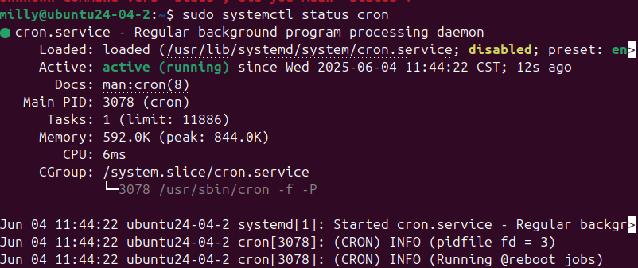
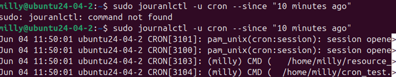

系統維運事件報告：cron任務未執行
發生時間：2025/06/04 11:50(UTC+8)
問題現象：
設定於 /etc/crontab 的定時任務未成功寫入 log，log 檔案 cron\_test.log 長時間未出現更新紀錄。

排查過程：
使用以下指令查看cron服務狀態
sudo systemctl status cron
檢查腳本檔案是否具備執行權限，使用以下指令：
ls -l /home/milly/cron\_test.sh
發現cron\_test.sh腳本的權限為-rw-rw-r--沒有執行權限

問題原因：
排程由 cron 正常呼叫腳本，但由於腳本本身無執行權限，導致內容無法執行、log 未寫入。
解決方法：
將cron\_test.sh腳本加上執行權限
sudo chmod +x /home/milly/cron\_test.sh
確認腳本目前權限
ls -l /home/milly/cron\_test.sh
等待5~10分鐘，確認cron\_test.log裡有內容
cat /home/milly/cron\_test.log

證據記錄：
利用指令systemctl確認cron服務狀態(圖一)

利用journalctl查看錯誤Log，確認排程是否執行(圖二)

Log記錄CRON[3104](milly) CMD (/home/milly/cron_test.sh)排程有執行

利用ls確認cron_test.sh腳本權限(圖三)

權限顯示-rw-rw-r--沒有執行權限

後續建議：
腳本建立完後用ls確認腳本權限
未來可在腳本建立完成後使用 ./script.sh 測試是否可正常執行，避免部署進入排程前已無效。

