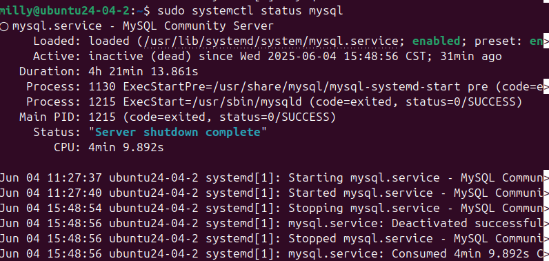

系統維運事件報告：MySQL無法連線
發生時間
2025/06/04 16:12:39(UTC+8)

問題現象
使用者嘗試連線MySQL失敗並且出現Can’t connect to local MySQL server through socket ‘/var/run/mysqld/mysqld.sock’(2)錯誤訊息

排查過程
利用systemctl指令確認MySQL服務狀態
sudo systemctl status mysql
發現MySQL服務狀態顯示inactive(dead)
初步排除設定錯誤與權限問題，判斷為服務未執行所致

問題原因
MySQL服務未啟動，導致無法透過預設 socket 成功建立本機連線。
解決方式
使用下列指令啟動mysql服務
sudo systemctl start mysql
執行下列指令確認服務狀態為active
sudo sysytemctl status mysql
再次使用mysql指令已可以正常連線

證據記錄
1.mysql服務狀態顯示inactive(dead)

(圖一)mysql服務狀態顯示inactive(dead)

後續建議
建議設定MySQL為開機時自動啟動服務
sudo systemctl enable mysql
2.可撰寫建議監控腳本檢查服務是否存活並在異常時進行重啟 
3.若有頻繁手動停啟需求，應建立內部 SOP 並強化切換流程紀錄