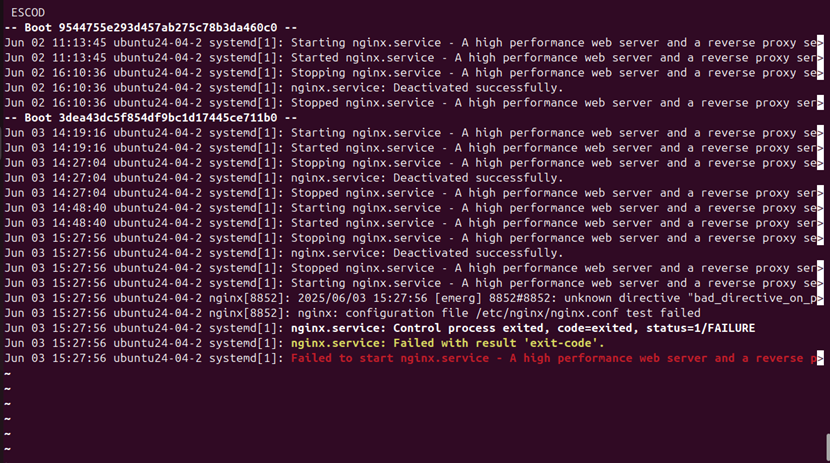

發生時間

Tue June 3 03:28:21 PM CST 2025

問題現象

使用者嘗試啟動nginx服務失敗，網站無法開啟

排查過程

利用`sudo journalctl -u nginx`來查詢錯誤Log，發現在15:27:56出現Failed to start nginx.service

問題原因

在/etc/nginx/nginx.conf中發現設定檔內誤加入未定義指令bad_directive_on_purpose使/etc/nginx/nginx.conf檔案測試失敗導致nginx服務無法啟動

解決方法

透過編輯器修正錯誤指令並利用`sudo systemctl restart nginx`嘗試重啟nginx服務

證據記錄

使用sudo journalctl nginx發現錯誤訊息nginx[51234]: nginx: [emerg] unknown directive "bad_directive_on_purpose" in /etc/nginx/nginx.conf:2
(如附圖)

後續建議：
1. 避免在/etc/nginx/nginx.conf檔案中使用錯誤語法
2. 使用 `nginx -t` 測試設定是否正確再重啟
3. 將 nginx.conf 加入版本控管避免誤修改
